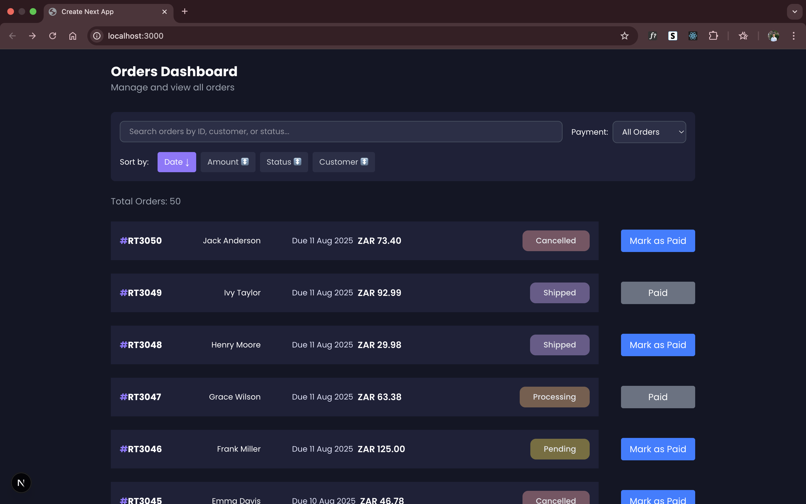
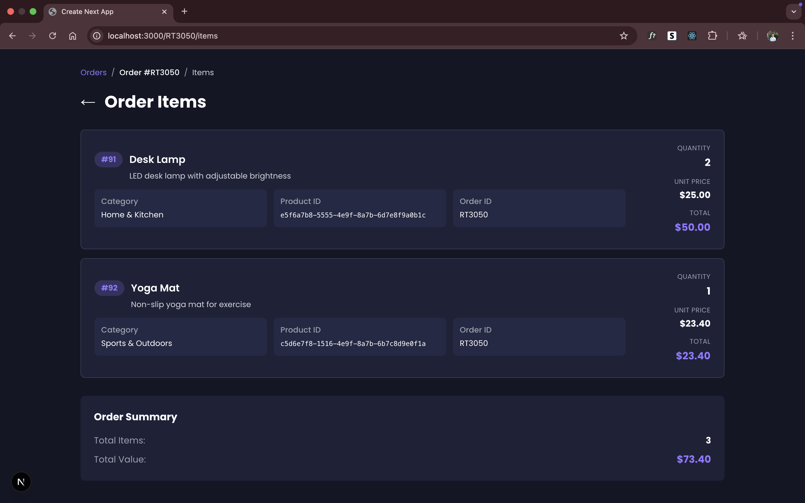

# Ekomi Assessment Project

## Table of Contents
1. [Prerequisites](#prerequisites)
2. [Setup Instructions](#setup-instructions)
   - [Database Setup](#1-database-setup)
   - [Backend Setup](#2-backend-setup)
   - [Frontend Setup](#3-frontend-setup)
3. [Quick Start](#quick-start)
4. [Application Views](#application-views)

## Prerequisites
- Docker & Docker Compose
- Node.js (latest LTS version) & npm (latest version)
- Make (for running Makefile commands)

## Setup Instructions

### 1. Database Setup
```bash
# Start the PostgreSQL database
docker-compose up -d
```

### 2. Backend Setup
```bash
# Navigate to backend directory
cd backend

# Run complete backend setup and start server
make run-backend
```

**The `run-backend` command consists of:**
- `npm install` - Install dependencies
- `make migrate-latest` - Run database migrations
- `make seed-run` - Seed the database
- `npm run dev` - Start development server

### 3. Frontend Setup
**⚠️ Open a new terminal window/tab for this step**

```bash
# Navigate to frontend directory (in a new terminal)
cd frontend

# Run complete frontend setup and start server
make run-frontend
```

**The `run-frontend` command consists of:**
- `npm install` - Install dependencies
- `npm run dev` - Start development server

## Quick Start
1. `docker-compose up -d` - Start database
2. `cd backend && make run-backend` - Setup and start backend
3. **Open new terminal:** `cd frontend && make run-frontend` - Setup frontend

## Services
- **Database**: PostgreSQL on port 5432
- **Backend**: Development server (check package.json for port)
- **Frontend**: Development server (check package.json for port)

## Stopping Services
```bash
# Stop database
docker-compose down

# Stop dev servers with Ctrl+C in respective terminals
```

## Application Views

### Main Page


### Items Page

### Items Page

